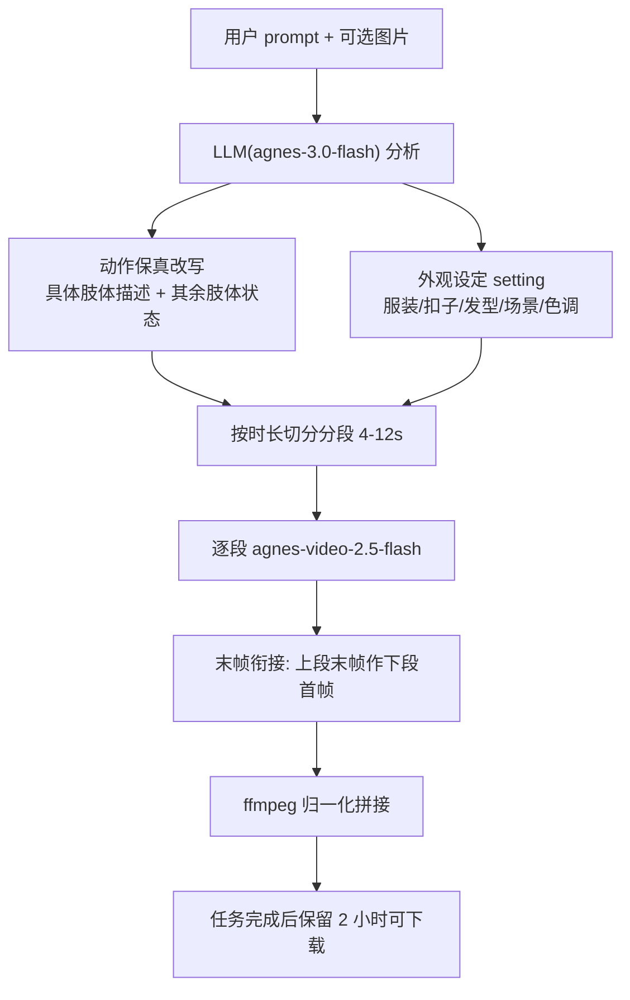
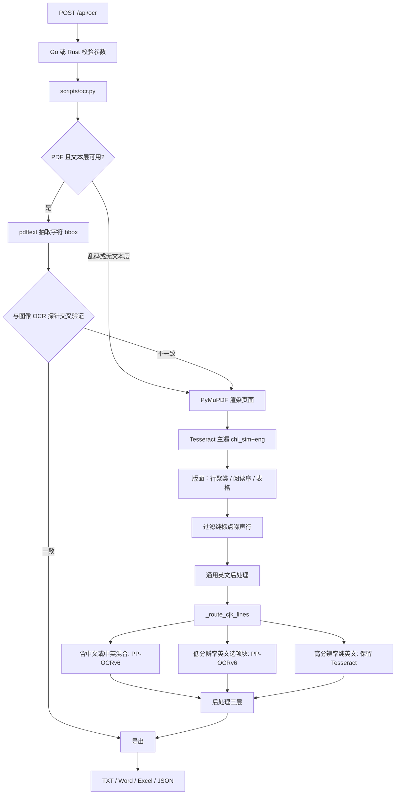

# FlowConvert

[](https://golang.org/)
[](https://www.rust-lang.org/)
[](./LICENSE)
[](#)

文档与媒体转换服务。Go 与 Rust 双实现共用同一套 Python 脚本；内置 OCR，扫描件/照片式 PDF 可识别并按原版式导出。

当前仓库默认分支为 `rust-rewrite`（Go + Rust 并存）。`main` 仅保留 Go。OCR 识别引擎是 `scripts/ocr.py`，Go / Rust 都通过子进程调用，不在服务端原生化。

## 🆕 v0.1.8 本次更新

**版本号 `v0.1.8`**（在上版 `v0.1.7` 基础上 +0.0.1）。本次聚焦图像换背景发丝边缘，不改变既有 API 契约。

### 新增 / 改进

| 类别 | 改动 |
|------|------|
| 图像·换背景 | `/api/convert/image/edit` 改为三级管线：先生成空场景背景，再把原图+背景一起发给 AI 合成（发丝边缘由模型处理），失败退回本地 `compose_bg.py`（rembg），再失败退回图生图。Go / Rust 双端对齐 |
| 图像·本地抠图 | `compose_bg.py` 关闭 rembg 的 alpha_matting / post_process（u2net 320x320 输出接近二值，这两项无改善）；改用 `pymatting.estimate_foreground_ml` 对羽化过渡区去污；pymatting 失败仍保留 rembg 掩膜 |
| 图像·超时 | 本地合成超时从默认 60s 提到 120s，避免大图 rembg 被误杀 |
| 对齐·模型名 | Rust 图像模型从 `agnes-image-2.1-flash` 对齐到 `agnes-image-2.5-flash` |

### 技术栈

- **双实现服务端**：Go 1.25（稳定，标准库为主）＋ Rust 2021 / axum（并行重写，业务能力对齐）
- **共用 Python 引擎**：`scripts/*.py` 子进程调用，Go/Rust 不原生化
  - OCR：Tesseract（主遍）＋ PP-OCR ONNX v6（中文/选项块路由）
  - 证件照：rembg `u2net_human_seg`（含 alpha matting + decontaminate）
  - 翻译：translatepy 多引擎（Google/DeepL/TranslateCom/MyMemory，无需 Key）
  - AI：Agnes 图像 / 视频 / LLM（`agnes-video-2.5-flash`、`agnes-image-2.5-flash`、`agnes-3.0-flash`）
- **系统依赖**：Tesseract、FFmpeg、Poppler、Inkscape、Potrace
- **前端**：`web/*.html`（原生 JS，无框架），单页 `index / ocr / translate / video / image / idphoto`

## 功能特性

| 功能 | 接口 | 说明 |
|------|------|------|
| 图片 → 矢量图 | `POST /api/convert/upload` | 支持 JPG/PNG/BMP/TIFF/WebP/GIF，输出 SVG/AI/DXF/EPS |
| PDF → Office | `POST /api/convert/pdf-to-office` | PDF 转 Word/Excel，无文本层时自动走 OCR |
| 素描效果 | `POST /api/convert/sketch` | 图片转素描风格 |
| 证件照 | `POST /api/convert/idphoto` | 多规格（一寸~六寸/签证/社保等），白/蓝/红/粉/黄等背景，可选 `hi_res` 高清 600DPI 出图 |
| 文本翻译 | `POST /api/translate` | 自动检测源语言，多引擎 fallback（Google/DeepL/TranslateCom），无需 API Key |
| 文件翻译 | `POST /api/translate/file` | 文档翻译下载（PDF/Word/Excel/PPT，含 OCR） |
| 链接翻译 | `POST /api/translate/url` | 输入网页 URL 提取正文并翻译（SSRF 防护） |
| OCR 文字识别 | `POST /api/ocr` | 图片/PDF 提取文字，原版式导出 TXT/Word/Excel/JSON，可翻译为简体中文，支持试卷模式 |
| AI 文生图 | `POST /api/convert/image/text` | 文本生成图像 |
| AI 视频生成 | `POST /api/convert/video/text` | 文本生成视频，动作保真 prompt 改写 |
| AI 视频（首尾帧） | `POST /api/convert/video/keyframe` | 首尾帧控制视频生成，外观设定锁定 |
| AI 视频（参考图） | `POST /api/convert/video/ref` | 多张参考图生成视频，外观设定锁定 |
| 下载管理 | `GET /api/download/{name}` | 文件下载与 TTL 自动清理 |

## 架构

```
浏览器 / curl
    │
    ▼
Go 服务 (main.go)  或  Rust 服务 (src/, cargo)
    │  HTTP 壳：路由、校验、限流、下载、任务状态管理
    ▼
scripts/*.py
    ├── ocr.py          OCR 主流程
    ├── pp_ocr_onnx.py  PP-OCR ONNX 推理（det v4 + rec v6）
    ├── agnes_video.py  AI 视频管线（LLM 分析 → 分段生成 → ffmpeg 拼接）
    ├── translate.py    翻译
    └── pdf2docx.py 等  格式转换
    │
    ▼
models/ocr/
    ├── det.onnx / cls.onnx     检测 / 方向分类
    ├── v6_rec.onnx             PP-OCRv6 识别（默认 rec）
    ├── ppocr_keys_v6.txt       v6 多语言字典（18708 键）
    ├── rec.onnx / rec_v5.onnx  v4 / v5 保留，中文主路线不用
    └── ppocr_keys_v1.txt       v4 字典兜底
```

Go 与 Rust 是同一套 HTTP API 的两种实现，业务能力对齐。OCR 参数（含 `exam`）序列化成 JSON，传给 `python3 scripts/ocr.py --options ...`。

## AI 视频管线

`scripts/agnes_video.py`，三种模式：文生视频 / 首尾帧 / 参考图。



一致性设计：

1. **动作保真**：用户对身体部位数量、左右手、姿势的指定逐字保留；抽象动作名（如"比心"）转写为具体肢体描述，并显式声明其余肢体状态（"左手自然下垂，不参与动作"），防止模型按常见姿势脑补。
2. **外观锁定**：`setting` 只生成一次，逐字拼进每个分段 prompt，全片复用。
3. **末帧衔接**：第 i 段以上一段的末帧为首帧（keyframe 模式），画面连续不跳场景。
4. **任务寿命**：运行中不回收（2 小时兜底）；完成后从完成时刻起保留 2 小时，与文件存储 TTL 对齐。

## OCR 管线

独立页面 `/ocr`，接口 `POST /api/ocr`。本地运行，无需 OCR API Key。

### 输入

- 格式：PNG / JPG / BMP / WEBP / GIF / TIFF / PDF，单文件不超过 50MB
- 来源：上传文件，或公网直链（`url` 与 `file` 二选一）
- 模式：`general`（快）/ `advanced`（多 PSM 取最优置信度）
- 质量：`normal`（150 DPI）/ `high`（300 DPI）
- 字形：`auto` / `zh_hans` / `zh_hant`
- 引擎：`auto`（优先 Tesseract，不可用回退 PP-OCR）/ `tesseract` / `pp_ocr`
- 试卷模式：`exam=1` 启用英语/语文试卷领域兜底；普通文档默认关闭

### 处理流程



要点：

1. **PDF 优先文本层**。可复制文字直接抽 bbox（`engine=pdftext`）。子集字体缺 ToUnicode 时判定乱码，回退图像 OCR，并写入 `warnings`。
2. **主遍是 Tesseract**。拿词框和阅读序；bbox 始终来自主遍，v6 只改文字、不动版面。
3. **按行分流 PP-OCRv6**（`_route_cjk_lines`）：含中文（含中英混合）→ v6 rec + jieba 通用纠错；低分辨率英文选项块 → v6 + 字符级纠错 + 选项规范化；高分辨率纯英文 → 保留 Tesseract。
4. **中文主路线固定 v6**。`pp_ocr_onnx.py` 默认 `v6_rec.onnx`；无内嵌字符表时按输出通道选字典（通道 > 10000 用 `ppocr_keys_v6.txt`）。v4/v5 模型仅作兼容保留。

### 后处理三层

| 层 | 作用范围 | 做什么 |
|----|----------|--------|
| 1. 置信度 | Tesseract 词 / v6 字符 | 低置信字符用第二候选替换 |
| 2. 词级纠错 | 英文 token | 词表 + 编辑距离 1；已在词表的词不动。正则 `[A-Za-z]+(?:['’][A-Za-z]+)*` 整词匹配含撇号缩略词，避免 `wouldn't` 被拆开误改 |
| 3. 固定搭配 | 仅 `exam=1` | 试卷英文整词映射、选项混淆矩阵、中文固定短语、行尾吞字补回 |

### 接口示例

```bash
curl -X POST -F "file=@photo.png" \
  -F "mode=advanced" -F "quality=high" -F "charset=auto" \
  -F "engine=auto" -F "redbox=1" -F "optimize=1" -F "translate=1" \
  -F "exam=1" \
  -F "formats=txt,docx,xlsx,json" \
  http://localhost:8080/api/ocr
```

返回字段：`text`、`translated_text`、`downloads`、`engine`、`pages`、`chars`、`charset`、`from_text_layer`、`layout`、`blocks`、`lines`、`filtered_headers`、`warnings`、`elapsed_ms`、`options`、`source`、`ext`、`empty`。

页面「预览」按导出格式分页展示；「复制」写入剪贴板。识别完成前两者禁用。

## 快速开始

### 环境要求

**语言运行时**

| 组件 | 版本要求 | 验证方式 |
|------|----------|----------|
| Go | 1.25+（实测 1.25.6） | `go version` |
| Rust | 2021 edition（`cargo`） | `rustc --version` |
| Python | 3.8+（实测 3.11.2） | `python3 --version` |

Go 与 Rust 二选一即可跑服务；OCR 始终需要 Python。

**系统依赖**

| 组件 | 版本（实测） | 用途 |
|------|--------------|------|
| Tesseract OCR | 5.3.0（需 `chi_sim` + `eng`） | 文字识别主遍 |
| FFmpeg | 5.1.9 | 视频分段/编码 |
| Poppler (`pdftoppm`) | 22.12.0 | PDF 页面渲染 |
| Inkscape | 1.2.2 | SVG→AI/EPS/PDF |
| Potrace | 1.16 | SVG→DXF |

**Python 依赖**：完整清单见 `requirements.txt`。可选增强（缺失自动降级）：`paddleocr`、`easyocr`。

### 安装 Tesseract OCR

```bash
# Ubuntu / Debian
sudo apt-get install -y tesseract-ocr tesseract-ocr-chi-sim tesseract-ocr-eng

# macOS
brew install tesseract tesseract-lang
```

Windows 从 https://github.com/UB-Mannheim/tesseract/wiki 安装，勾选中文语言包。

```bash
tesseract --version
tesseract --list-langs
```

应包含 `chi_sim` 与 `eng`。

### 一键安装（推荐）

```bash
bash install.sh
sudo bash install.sh
SKIP_SYSTEM=1 bash install.sh
SKIP_MODELS=1 bash install.sh
```

脚本创建 `.venv` 并安装 `requirements.txt`。启动时设 `FLOWCONVERT_PYTHON=.venv/bin/python`。

### 手动安装 Python 依赖

```bash
pip install -r requirements.txt
```

### 编译运行

```bash
git clone https://github.com/647133036/flowconvert-web.git
cd flowconvert-web
```

Go（稳定实现）：

```bash
go build -o flowConvert .
./flowConvert
```

Rust（`rust-rewrite` 分支）：

```bash
cargo build --release
./target/release/flowconvert
```

默认监听 `8080`。

### 配置

| 变量 | 默认值 | 说明 |
|------|--------|------|
| `FLOWCONVERT_PORT` | `8080` | 服务监听端口 |
| `FLOWCONVERT_DATA` | `data` | 数据目录（tmp/output 在此下） |
| `FLOWCONVERT_BASE_URL` | `http://localhost:8080` | 公网访问地址（生成下载链接） |
| `AGNES_API_KEY` | - | Agnes AI 图像/视频生成 API Key |
| `AGNES_BASE_URL` | `https://apihub.agnes-ai.cn/v1` | Agnes API 端点（Go/Rust/Python 三端一致） |
| `SENSENOVA_API_KEY` | - | SenseNova 备用图像生成 API Key |
| `FLOWCONVERT_PYTHON` | `python3` | Python 解释器路径 |

示例 `.env`：

```bash
AGNES_API_KEY=your-agnes-api-key-here
FLOWCONVERT_BASE_URL=https://your-domain.com
```

### Docker 部署

```bash
docker build -t flowconvert .
docker run -p 8080:8080 \
  -e AGNES_API_KEY=your-key \
  -e FLOWCONVERT_BASE_URL=https://your-domain.com \
  flowconvert
```

## 项目结构

```
flowconvert/
├── main.go                 Go 入口与路由
├── middleware.go           CORS / 限流 / 安全头
├── go.mod                  Go 模块（无版本字段，发布版本以 Cargo.toml 为准）
├── Cargo.toml              Rust crate，当前 version = 0.1.8
├── src/                    Rust 实现
│   ├── main.rs / lib.rs
│   ├── handler/            HTTP 处理器（含 ocr.rs exam 字段）
│   └── service/            业务（ocr.rs 调用 scripts/ocr.py）
├── internal/               Go 实现（config / handler / service）
├── scripts/
│   ├── ocr.py              OCR 主流程与后处理
│   ├── pp_ocr_onnx.py      PP-OCR ONNX（默认 v6 rec）
│   ├── agnes_video.py      AI 视频管线（LLM 分析 → 分段生成 → ffmpeg 拼接）
│   ├── translate.py
│   ├── pdf2docx.py / pdf2xlsx.py
│   ├── idphoto.py / sketch.py / vectorize.py / video.py
│   └── ...
├── models/ocr/             det / v6_rec / 字典
├── install.sh
├── requirements.txt
└── web/                    前端（index / ocr / translate / video / image）
```

## API 示例

### 文本翻译

```bash
curl -X POST http://localhost:8080/api/translate \
  -H "Content-Type: application/json" \
  -d '{"text":"Hello world","source":"auto","target":"zh"}'
```

```json
{
  "success": true,
  "translated_text": "你好世界",
  "detected_language": "en",
  "engine": "translatepy"
}
```

引擎优先级：Google → DeepL → LibreTranslate → TranslateCom → MyMemory。无需 API Key。支持 16 种语言。

### 图片转矢量

```bash
curl -X POST http://localhost:8080/api/convert/upload \
  -F "file=@photo.jpg" \
  -F "output_format=svg"
```

### PDF 转 Word（含 OCR）

```bash
curl -X POST http://localhost:8080/api/convert/pdf-to-office \
  -F "file=@scan.pdf" \
  -F "output_format=docx"
```

扫描版 PDF 自动触发 OCR。

### 文本生成视频

```bash
curl -X POST http://localhost:8080/api/convert/video/text \
  -F "prompt=一个女孩跳舞，右手抬至脸颊旁比心，左手自然下垂不动" \
  -F "duration=10" \
  -F "aspect_ratio=16:9"
```

轮询：`GET /api/convert/video/task/{task_id}`。任务完成后保留 2 小时。

## 安全特性

- **SSRF 防护**：DNS 解析校验 + 建连瞬间 IP 白名单；下载拒绝内网/回环
- **上传校验**：扩展名与 MIME 双重匹配，限制请求体大小
- **文件大小**：上传默认 50MB，下载图片 100MB / 视频 500MB
- **路径穿越防护**：文件名净化 + 路径规范化
- **限流**：每 IP 滑动窗口，bucket 上限 10000
- **并发**：视频生成最多 6 个任务，超出 503
- **任务寿命**：视频任务运行中不回收，完成后保留 2 小时；文件存储 TTL 2 小时
- **错误脱敏**：内部错误只记 stderr
- **输入校验**：输出格式白名单、提示词 2000 字符、数值范围、JSON body 大小
- **安全响应头**：`nosniff`、`DENY`、XSS Protection、CSP

## 开发

```bash
# Go
go test ./...
go test ./internal/handler -v -run TestVideoJob
go run .

# Rust
cargo test
cargo run
```

## 版本历史

- **v0.1.8** (2026-09) 换背景发丝边缘
  - 图像编辑三级管线：AI 空场景 → AI 合成（原图+背景）→ 本地 rembg → 图生图
  - `compose_bg.py` 用 pymatting 去污，失败时保留 rembg 掩膜
  - Rust 图像模型对齐 `agnes-image-2.5-flash`

- **v0.1.7** (2026-09) AI 视频可靠性与一致性
  - 修复视频任务过早过期：GC 依据从创建时间改为完成时间，运行中 2 小时兜底，完成后保留 2 小时（Go + Rust 双端）
  - 动作保真 prompt 改写：身体部位指定逐字保留（单手不再变双手），抽象动作转写为具体肢体描述
  - 外观设定锁定：`setting` 字段逐字拼进每个分段，修复分段间服装/场景细节漂移
  - `AGNES_BASE_URL` 默认值 Go/Python 对齐为 `.cn`

- **v0.1.6** (2026-09) 质量加固 + 能力增强 + 全量审查
  - 证件照新增「输出规格」：标准 300DPI / 高清 600DPI（像素×4），前端开关贯通后端
  - 证件照发丝换底色对齐换背景管线（抠图 1600、先合成后缩放、alpha 羽化）
  - 修复本地图像编辑只认 PNG（`png.Decode`→`image.Decode` 全格式）并补回归测试
  - SSRF：`validateDownloadURL` 复用 `isBlockedIP`，补 CGNAT/TEST-NET/多播拦截
  - 新增 Agnes 视频 Python 管线（LLM 分析 + 分段生成 + ffmpeg 拼接 + 去水印）
  - OCR 试卷后处理与字符集修正；全量代码/安全/单测/集成回归通过

- **v0.1.5** (2026-09) 证件照增加黄色背景
  - 背景颜色新增「黄色」（`#FFCC00`），前后端 `BACKGROUNDS` 与页面选项对齐
  - 颜色选项行距加大，第二行文字不再挡住第一行标签

- **v0.1.4** (2026-09) PP-OCRv6 主路线 + 试卷后处理 + Rust exam 贯通
  - 识别模型：PP-OCR rec 默认切换到 `models/ocr/v6_rec.onnx`，字典 `ppocr_keys_v6.txt`（18708 键，含 Unicode 罗马数字）。无内嵌字符表时按 rec 输出通道选 v6 / v1 字典。中文行、中英混合行、低分辨率英文选项块走 v6；高分辨率纯英文仍走 Tesseract。不回退 v4 作为中文主路线。
  - Rust：`OcrOptions` 与 `/api/ocr` handler 增加 `exam`，与 Go / Web / `scripts/ocr.py` 对齐，JSON 原样传给 Python。
  - 词级纠错：token 正则改为含撇号的整词，避免 `wouldn't` 被切成 `would` + `t`。
  - 纯标点行过滤：`_is_punct_only` 在阅读序与 `group_blocks` 双向丢弃无字母/数字/汉字的噪声（孤立破折号等）。
  - exam 英文固定映射：`tho/mako/Holon/Icttcr/aftemoon/Everv/Sundav`、`patients(人)`→`patients(病人)`、`一Yes`→`—Yes`、数字字母粘连拆分。
  - 题号：括号统一为 `( )`，分隔符固定 `.`，`SOIZB`→`50128`。
  - 符号与挖空：`I'I`→`I'll`、`but|`→`but I`、`form i`→`___`；中文行尾 `三个选/选出一/读两` 补字。
  - 表格单元格补词级纠错与 exam 英文修复；v6 非选项行走完 rec 后补 `_fix_exam_english`。
  - 纯英文 Tesseract 路径在 `analyze_page` 补齐词级纠错 / 空格恢复 / exam 映射。

- **v0.1.3** (2026-09) OCR 能力升级与链接翻译
  - 独立 OCR 页 `/ocr` 与 `/api/ocr`，双引擎 Tesseract + PP-OCR ONNX，原版式导出、红框、繁简转换
  - 链接翻译 `/api/translate/url`（SSRF 防护 + 正文提取）
  - 试卷模式初版：选项混淆矩阵、选项头规范化、英文词修正
  - 修复 `detect_orientation` 置信度量纲（0-100 被当成 0-1）
  - 弯撇号 `’` 与直撇号 `'` 统一匹配
  - 中文行 CJK 路由 + jieba 通用纠错
  - 视频分段跳帧与证件照人脸检测降级
  - `requirements.txt` 审计，新增 `install.sh`

- **v0.1.2** (2026-08) 代码审查修复
  - 视频参数改 `json.Marshal`；时长上限 120s；64MB BodyLimit
  - ffprobe / ffmpeg / 字体探测超时；会话 TTL 2 小时
  - 前端 `rel=noopener noreferrer`

- **v0.1.1** (2026-08) 安全加固与并发控制
  - 限流器、视频并发 6、错误脱敏、SSRF、白名单、CSP、XSS

- **v0.1.0** (2026-08) 初始版本
  - 格式转换、Tesseract OCR、证件照、多引擎翻译、AI 图像/视频

## 贡献

1. Fork 本仓库
2. 创建特性分支（`git checkout -b feat/xxx`）
3. 提交更改（`git commit -m 'feat: add xxx'`）
4. 推送到分支（`git push origin feat/xxx`）
5. 创建 Pull Request

## 许可证

本项目采用 [Apache License 3.0](./LICENSE) 开源协议。

---

AI 视频/图像生成需要有效 API Key。OCR 需要系统安装 Tesseract 及中文语言包，并保留 `models/ocr/v6_rec.onnx` 与 `ppocr_keys_v6.txt`。翻译无需 Key。
